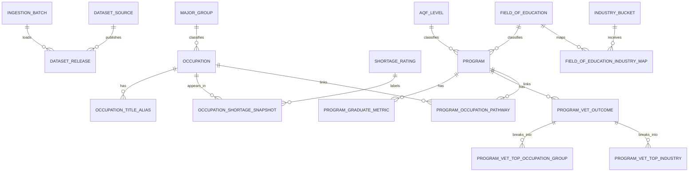
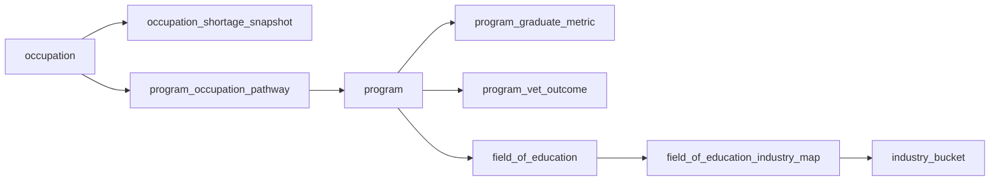

# Assignment ERD

## Submission Summary

The database was designed as a 3-layer PostgreSQL architecture.

- Stage layer: 5 raw landing tables mirroring the cleaned CSVs
- Core layer: 16 normalized relational tables
- Mart layer: 4 frontend-ready views

The core design resolves:

- occupation master data
- shortage facts
- program master data
- graduate and VET outcome facts
- many-to-many program-to-occupation pathways
- release lineage and data provenance

## Main ERD



## Frontend Join Path



## Assignment Notes

- `occupation` is the canonical occupation entity keyed by ANZSCO code.
- `occupation.salary_median` stores the pre-computed occupation-level salary used by the frontend.
- `program` is the canonical course or qualification entity keyed by program code.
- `program_graduate_metric.is_apprenticeship` stores the pipeline-aligned apprenticeship classification used by the frontend mart.
- `program_occupation_pathway` resolves the many-to-many relationship between programs and occupations.
- `program_vet_top_occupation_group` and `program_vet_top_industry` are the 1NF correction for repeated VET columns.
- `occupation_shortage_snapshot`, `program_graduate_metric`, and `program_vet_outcome` are fact tables because they record measures about a specific business object at a specific dataset release.
- `dataset_source`, `dataset_release`, and `ingestion_batch` preserve lineage, freshness, and reproducibility.

## Frontend Output Shape

The career-card mart is designed to return:

```json
[
  {
    "anzsco_code": "341111",
    "title": "Electrician",
    "industry": "Construction",
    "median_salary": 82000,
    "pathway": "Apprenticeship",
    "shortage_status": "In Shortage"
  }
]
```
