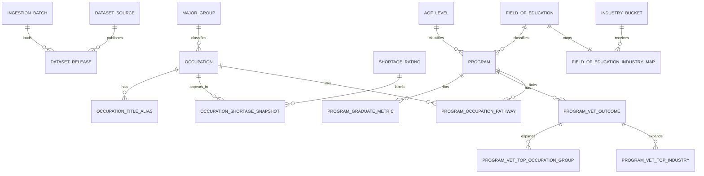

# PathwayIQ Database Implementation Audit

## Executive Summary

This repository now contains the recent PostgreSQL database design package and the earlier SQLite / Cloudflare D1 package.

The verified database files present in the repo are:

- `data/pathwayiq-Data Pipeline/database/postgresql-logical-model.sql`
- `data/pathwayiq-Data Pipeline/database/postgresql-physical-schema.sql`
- `docs/postgresql-relational-design.md`
- `docs/postgresql-physical-design.md`
- `docs/pathwayiq-erd.md`
- `data/pathwayiq-Data Pipeline/database/schema.sql`
- `data/pathwayiq-Data Pipeline/database/build_d1_database.py`
- `data/pathwayiq-Data Pipeline/database/upload_frontend_exports_r2.py`
- `data/pathwayiq-Data Pipeline/database/README.md`

The PostgreSQL package is the strongest relational design in the repo and should be treated as the authoritative relational model for the assignment.

At a high level, the implemented design follows the database design lifecycle recommended in the database material:

1. define the business requirement
2. identify the entities and business rules
3. normalize the source data into stable relations
4. enforce entity, referential, and domain integrity
5. create a physical schema with indexes and load strategy
6. expose denormalized mart views for the frontend

## What Was Built

The PostgreSQL database follows a 3-layer architecture.

- `pathwayiq_stage`: 5 raw landing tables mirroring the cleaned CSVs
- `pathwayiq_core`: 18 normalized relational tables
- `pathwayiq_mart`: 4 frontend-facing views

This separation is good practice because it keeps ingestion, canonical storage, and application delivery concerns separate.

## Source Datasets Used

The PostgreSQL model was derived from the 5 cleaned datasets that matter most for the career-card frontend journey.

| Cleaned dataset | Business role | Main join key | Derived tables |
|---|---|---|---|
| `clean_anzsco_reference.csv` | occupation master reference | `anzsco_code` | `occupation`, `occupation_title_alias`, `major_group` |
| `clean_osl_filtered.csv` | shortage facts | `anzsco_code` | `occupation_shortage_snapshot`, `shortage_rating` |
| `clean_vnda_course_occupations.csv` | course-to-occupation bridge | `course_id`, `anzsco_code` | `program_occupation_pathway`, `program` |
| `clean_vnda_course_metrics.csv` | graduate employment and income facts | `course_id` | `program_graduate_metric`, `program`, `aqf_level`, `field_of_education` |
| `clean_vet_outcomes.csv` | VET outcomes and repeated top-3 attributes | `program_id` | `program_vet_outcome`, `program_vet_top_occupation_group`, `program_vet_top_industry`, `program`, `aqf_level`, `field_of_education` |

## How The Relational Database Was Derived

### Step 1. Define The Frontend Question

The database was scoped around the main student-facing question:

Which occupations are relevant, what is their shortage status, what pathway leads to them, and what median salary should be shown?

That requirement immediately suggested the need for:

- an occupation entity
- a program entity
- a shortage fact
- a salary-bearing program fact
- a bridge between programs and occupations

### Step 2. Determine The Grain Of Each Dataset

Each dataset was examined to identify what one row actually represents.

- `clean_anzsco_reference.csv`: one row per ANZSCO title entry, not one row per occupation
- `clean_osl_filtered.csv`: one row per occupation shortage assessment
- `clean_vnda_course_occupations.csv`: one row per course-to-occupation pathway rank
- `clean_vnda_course_metrics.csv`: one row per course metric summary
- `clean_vet_outcomes.csv`: one row per program summary, but with repeated top-3 columns

Establishing row grain first is critical for avoiding partial and transitive dependencies later.

### Step 3. Identify Candidate Keys

The stable business identifiers were identified before surrogate keys were introduced.

- occupation business key: `anzsco_code`
- program business key: `program_id` or `course_id`, unified as `program_code`
- shortage fact grain: one occupation per dataset release
- graduate metric grain: one program per dataset release
- VET outcome grain: one program per dataset release

### Step 4. Build The Conceptual Model

The conceptual entities were:

- occupation
- occupation title alias
- shortage rating
- program
- AQF level
- field of education
- graduate metric
- VET outcome
- program-to-occupation pathway
- dataset release lineage

The major business relationships were:

- one major group has many occupations
- one occupation has many aliases
- one occupation has many shortage snapshots over time
- one program can connect to many occupations
- one occupation can connect to many programs
- one VET outcome has up to three top occupation-group rows
- one VET outcome has up to three top industry rows

### Step 5. Apply First Normal Form

The cleaned CSVs still contained repeating groups, so 1NF work was necessary.

1NF corrections applied:

- repeated ANZSCO title entries were separated into `occupation_title_alias`
- repeated VET top-3 occupation columns were unpivoted into `program_vet_top_occupation_group`
- repeated VET top-3 industry columns were unpivoted into `program_vet_top_industry`
- the many-to-many relationship between programs and occupations was isolated into `program_occupation_pathway`

This removes repeating columns and ensures every field holds a single atomic value.

### Step 6. Apply Second Normal Form

Second Normal Form required non-key attributes to depend on the whole key.

2NF corrections applied:

- descriptive program fields were separated from outcome metrics and stored in `program`
- descriptive occupation fields were separated from shortage facts and stored in `occupation`
- outcome measures were stored only in the fact tables that match their grain

This prevents partial dependency problems such as repeating the same program description in every pathway or metrics row.

### Step 7. Apply Third Normal Form

Third Normal Form required the removal of transitive dependencies.

3NF corrections applied:

- shortage labels were moved to `shortage_rating`
- AQF names and pathway classification were moved to `aqf_level`
- repeated field-of-education values were moved to `field_of_education`
- industry assignment was not hard-coded inside `program`; instead it was normalized through `industry_bucket` and `field_of_education_industry_map`

This is especially important because the older flat-file approach handled industry crudely, whereas the bridge table makes the mapping explicit and reviewable.

### Step 8. Convert The Logical Model Into A Physical PostgreSQL Schema

Once the logical model was stable, physical PostgreSQL best practices were applied.

- surrogate identity keys were added to core tables
- natural business keys were retained as unique alternate keys
- domains were introduced for percentages, non-negative amounts, and ANZSCO code format
- foreign keys were added to enforce referential integrity
- `updated_at` triggers were added for auditability
- `UNLOGGED` stage tables were used for faster bulk loads
- targeted indexes were added for joins and search patterns

### Step 9. Design The Mart Layer

The mart layer was added to support the frontend without making the frontend join normalized tables itself.

The main mart outputs are:

- `vw_frontend_occupations`
- `vw_frontend_programs`
- `vw_frontend_pathways`
- `vw_frontend_career_cards`

`vw_frontend_career_cards` is the most important frontend view because it returns:

- `anzsco_code`
- `title`
- `industry`
- `median_salary`
- `pathway`
- `shortage_status`

This aligns with the desired student-facing payload and deliberately excludes `ai_risk`.

## Full Table Inventory

### Stage Tables

| Table | Purpose | Notes |
|---|---|---|
| `pathwayiq_stage.stg_anzsco_reference` | raw landing for cleaned ANZSCO reference | preserves source title rows |
| `pathwayiq_stage.stg_osl_filtered` | raw landing for cleaned OSL filtered file | shortage facts before normalization |
| `pathwayiq_stage.stg_vnda_course_occupations` | raw landing for course-to-occupation pathways | includes match metadata |
| `pathwayiq_stage.stg_vnda_course_metrics` | raw landing for graduate metrics | text-heavy for robust `COPY` |
| `pathwayiq_stage.stg_vet_outcomes` | raw landing for VET outcomes | preserves repeated top-3 columns before unpivot |

### Core Tables

| Table | Role | Primary key | Main foreign keys |
|---|---|---|---|
| `pathwayiq_core.ingestion_batch` | ETL batch lineage | `ingestion_batch_id` | — |
| `pathwayiq_core.dataset_source` | dataset family registry | `dataset_source_id` | — |
| `pathwayiq_core.dataset_release` | specific loaded release | `dataset_release_id` | `dataset_source_id`, `ingestion_batch_id` |
| `pathwayiq_core.major_group` | ANZSCO major-group reference | `major_group_id` | — |
| `pathwayiq_core.shortage_rating` | shortage label lookup | `shortage_rating_id` | — |
| `pathwayiq_core.aqf_level` | AQF lookup and pathway type | `aqf_level_id` | — |
| `pathwayiq_core.field_of_education` | field-of-education lookup | `field_of_education_id` | — |
| `pathwayiq_core.industry_bucket` | frontend industry bucket | `industry_bucket_id` | — |
| `pathwayiq_core.field_of_education_industry_map` | FOE to industry mapping bridge | `field_of_education_id` | `industry_bucket_id` |
| `pathwayiq_core.occupation` | canonical occupation entity | `occupation_id` | `major_group_id` |
| `pathwayiq_core.occupation_title_alias` | alternate occupation titles | `occupation_title_alias_id` | `occupation_id` |
| `pathwayiq_core.occupation_shortage_snapshot` | shortage fact table | `occupation_shortage_snapshot_id` | `dataset_release_id`, `occupation_id`, `national_shortage_rating_id`, `victoria_shortage_rating_id` |
| `pathwayiq_core.program` | canonical program entity | `program_id` | `aqf_level_id`, `field_of_education_id` |
| `pathwayiq_core.program_graduate_metric` | VNDA graduate metric fact | `program_graduate_metric_id` | `dataset_release_id`, `program_id` |
| `pathwayiq_core.program_vet_outcome` | VET outcomes fact | `program_vet_outcome_id` | `dataset_release_id`, `program_id` |
| `pathwayiq_core.program_vet_top_occupation_group` | 1NF child table for VET top occupations | `program_vet_top_occupation_group_id` | `program_vet_outcome_id` |
| `pathwayiq_core.program_vet_top_industry` | 1NF child table for VET top industries | `program_vet_top_industry_id` | `program_vet_outcome_id` |
| `pathwayiq_core.program_occupation_pathway` | many-to-many bridge between programs and occupations | `program_occupation_pathway_id` | `dataset_release_id`, `program_id`, `occupation_id` |

### Mart Views

| View | Purpose |
|---|---|
| `pathwayiq_mart.vw_frontend_occupations` | occupation-level cards and shortage filter values |
| `pathwayiq_mart.vw_frontend_programs` | program-level cards and metrics |
| `pathwayiq_mart.vw_frontend_pathways` | joined program-to-occupation pathways |
| `pathwayiq_mart.vw_frontend_career_cards` | final career-card dataset for frontend export |

## How The Tables Connect

The following relationship list is the cleanest guide for drawing the ERD.

| Parent | Child | Cardinality | Relationship meaning |
|---|---|---|---|
| `ingestion_batch` | `dataset_release` | 1:M | one ETL batch can load many dataset releases |
| `dataset_source` | `dataset_release` | 1:M | one source can have many releases |
| `major_group` | `occupation` | 1:M | one major group contains many occupations |
| `occupation` | `occupation_title_alias` | 1:M | one occupation has many aliases |
| `occupation` | `occupation_shortage_snapshot` | 1:M | one occupation can appear in many releases |
| `shortage_rating` | `occupation_shortage_snapshot` | 1:M | one rating label is reused by many snapshots |
| `aqf_level` | `program` | 1:M | one AQF level classifies many programs |
| `field_of_education` | `program` | 1:M | one FOE classifies many programs |
| `field_of_education` | `field_of_education_industry_map` | 1:1 | each FOE maps to one industry bucket in this design |
| `industry_bucket` | `field_of_education_industry_map` | 1:M | one industry bucket can serve many FOEs |
| `program` | `program_graduate_metric` | 1:M | one program can have many release-specific graduate metrics |
| `program` | `program_vet_outcome` | 1:M | one program can have many release-specific VET outcomes |
| `program_vet_outcome` | `program_vet_top_occupation_group` | 1:M | one VET outcome expands to top occupation-group rows |
| `program_vet_outcome` | `program_vet_top_industry` | 1:M | one VET outcome expands to top industry rows |
| `program` | `program_occupation_pathway` | 1:M | one program can map to many occupations |
| `occupation` | `program_occupation_pathway` | 1:M | one occupation can be reached by many programs |
| `dataset_release` | `occupation_shortage_snapshot` | 1:M | snapshots are release-specific |
| `dataset_release` | `program_graduate_metric` | 1:M | graduate metrics are release-specific |
| `dataset_release` | `program_vet_outcome` | 1:M | VET outcomes are release-specific |
| `dataset_release` | `program_occupation_pathway` | 1:M | pathway mappings are release-specific |

### ERD Sketch



## PostgreSQL Best Practices Applied

The schema follows the strongest database-quality practices from the coursework themes.

### 1. Entity Integrity

- every core table has a primary key
- business keys such as `occupation_code` and `program_code` are unique
- nullability is restricted where the business rule requires a value

### 2. Referential Integrity

- foreign keys connect fact tables to dimensions and lineage tables
- orphan records are prevented at the database level
- mart views join from governed core tables rather than directly from stage files

### 3. Domain Integrity

- `percentage_value` limits percentages to 0–100
- `non_negative_amount` prevents negative salary values
- `anzsco_code_value` enforces a six-digit ANZSCO format
- explicit `CHECK` constraints protect pathway and rank fields

### 4. Normalization

- repeating groups removed to child tables
- descriptors separated from facts
- lookup values normalized to reference tables
- transitive dependencies reduced through controlled bridges such as `field_of_education_industry_map`

### 5. Lineage And Reproducibility

- `ingestion_batch`, `dataset_source`, and `dataset_release` preserve source lineage
- stage tables preserve the cleaned source rows before normalization
- the load order is documented in `docs/postgresql-physical-design.md`

### 6. Physical Performance Considerations

- `UNLOGGED` stage tables support fast bulk loads
- natural and normalized title indexes support lookup and matching
- bridge and fact join indexes support mart queries
- `occupation.salary_median` is persisted to avoid re-deriving salary on every frontend request

## Frontend Readiness Assessment

### What The Database Can Provide

The PostgreSQL mart is capable of providing the frontend career-card payload in the intended form:

```json
[
  {
    "anzsco_code": "341111",
    "title": "Electrician",
    "industry": "Construction",
    "median_salary": 82000,
    "pathway": "Apprenticeship",
    "shortage_status": "In Shortage"
  }
]
```

This is supported by `pathwayiq_mart.vw_frontend_career_cards`.

### What The Current App Layer Still Does

The current application code is not yet wired to consume the PostgreSQL mart directly.

- `apps/web/lib/api-client.ts` is empty
- `apps/web/hooks/useCareerSearch.ts` still reads local mock data from `apps/web/lib/career-data.ts`
- `apps/api/src/services/data-client.ts` still reads legacy JSON objects from Cloudflare R2
- the API layer still carries older `ai_risk`-based shapes and is therefore not yet aligned with the new database mart

### Conclusion On Frontend Fit

The database design itself is suitable for the simplified frontend career-card contract.

The remaining gap is not the relational model. The remaining gap is application integration:

- export the mart view to JSON or CSV
- update the API contract to use `median_salary` rather than min/max salaries
- remove legacy `ai_risk` dependencies from the application layer if that feature is no longer required

## Pipeline And Repository Audit Findings

### Fixes Applied

The following concrete fixes were applied during this audit.

- `healthcheck_pipeline.py` was hardened so it no longer crashes at import time when `pandas` or `audit_cleaned_data` cannot be imported
- the healthcheck now writes a diagnostic report even when dependencies or raw files are missing
- the stray agent worktree directory was removed from the repo tree
- root `.gitignore` was updated to ignore the real `raw_data/` path and `.xls` files
- the misnamed `data/pathwayiq-Data Pipeline/gitignore` file was corrected to `.gitignore`
- `docs/assignment-erd.md` was renamed to `docs/pathwayiq-erd.md`
- the ERD and relational-design docs were corrected to show the real core-table count of 18

### Current Anomalies Still Present

These are important findings from the audit of the live repo state.

1. Only 1 of the 8 expected raw source files is present in `data/pathwayiq-Data Pipeline/raw_data/`.
2. The repo currently does not contain generated `silver/` or `cleaned_data/` outputs.
3. The local Python environment in this workspace does not have the full pipeline dependencies installed, so a full pipeline run cannot be validated here.
4. The current app/API layer still reflects an older JSON contract rather than the new PostgreSQL mart.
5. A duplicate legacy file exists at `apps/api/src/functions/search.js` alongside `search.ts`, which creates a maintenance risk.
6. The database design documents exist, but the repo does not yet include a stage-to-core PostgreSQL load script with executable `INSERT ... SELECT` statements.

## Final Verdict

From a database design perspective, the PostgreSQL model is well reasoned and consistent with best practice:

- the subject areas are properly normalized
- the many-to-many relationships are modelled correctly
- integrity rules are enforced in the database
- lineage and reproducibility are explicitly designed
- the mart layer is appropriate for frontend delivery

The most important remaining work is operational rather than conceptual:

- load the missing raw datasets
- install the pipeline runtime dependencies
- implement and validate the PostgreSQL load script
- connect the frontend or API layer to the mart output

For assignment purposes, the database structure, the normalization rationale, and the ERD-ready relationship model are all present and defensible.
