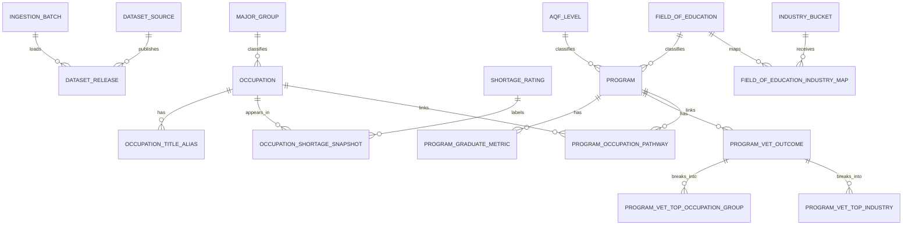

# PostgreSQL Relational Design

## What Was Built

The database follows a 3-layer PostgreSQL architecture and applies the normalization process described in Coronel and Morris Chapters 3 to 5.

- Stage layer: 5 raw landing tables mirroring the cleaned CSVs exactly for provenance and reproducibility.
- Core layer: 18 normalized tables for lineage, reference data, entities, facts, and bridge tables.
- Mart layer: 4 frontend-ready views that return simplified records for the application and Cloudflare-hosted exports.

The selected scope uses the five datasets that matter most for the frontend journey:

- `clean_anzsco_reference.csv`
- `clean_osl_filtered.csv`
- `clean_vnda_course_occupations.csv`
- `clean_vnda_course_metrics.csv`
- `clean_vet_outcomes.csv`

## Real Source Counts Used In The Design

The current cleaned CSVs in the repository produce the following design-driving counts.

- `clean_anzsco_reference.csv`: 3,223 title rows
- `clean_osl_filtered.csv`: 916 occupation rows
- `clean_vnda_course_occupations.csv`: 1,606 course-to-occupation rows
- `clean_vnda_course_metrics.csv`: 494 course metric rows
- `clean_vet_outcomes.csv`: 293 program outcome rows

The main normalized entities derived from those files are:

- `occupation`: 916 canonical occupation rows
- `occupation_title_alias`: 3,223 alias rows
- `occupation_shortage_snapshot`: 916 shortage rows
- `program`: 543 combined program rows across VNDA and VET
- `program_graduate_metric`: 494 rows
- `program_vet_outcome`: 293 rows
- `program_vet_top_occupation_group`: 879 rows
- `program_vet_top_industry`: 851 rows
- `program_occupation_pathway`: 1,606 rows

## Stage Layer

The stage layer preserves the cleaned inputs exactly before any further normalization.

- `pathwayiq_stage.stg_anzsco_reference`
- `pathwayiq_stage.stg_osl_filtered`
- `pathwayiq_stage.stg_vnda_course_occupations`
- `pathwayiq_stage.stg_vnda_course_metrics`
- `pathwayiq_stage.stg_vet_outcomes`

These tables exist for:

- provenance
- repeatable reloads
- easier defect tracing
- separation of raw cleaned data from curated relational structures

## Core Layer

### Lineage Tables

- `pathwayiq_core.ingestion_batch`
- `pathwayiq_core.dataset_source`
- `pathwayiq_core.dataset_release`

These tables allow every record to be traced back to a load batch and dataset release.

### Reference Tables

- `pathwayiq_core.major_group`
- `pathwayiq_core.shortage_rating`
- `pathwayiq_core.aqf_level`
- `pathwayiq_core.field_of_education`
- `pathwayiq_core.industry_bucket`
- `pathwayiq_core.field_of_education_industry_map`

These hold stable lookup values so descriptions are not duplicated throughout fact tables.

### Main Entity Tables

- `pathwayiq_core.occupation`
- `pathwayiq_core.occupation_title_alias`
- `pathwayiq_core.program`

`occupation` stores the canonical ANZSCO occupation keyed by `occupation_code`.

It also stores `salary_median`, which is pre-computed during ETL so occupation cards do not need to recalculate salary at request time.

`occupation_title_alias` stores every ANZSCO title row from the reference file. This separates alternate titles from the occupation master table.

`program` stores one descriptor row per program or course across VNDA and VET. It contains descriptive data only and does not repeat outcome measures.

### Fact And Bridge Tables

- `pathwayiq_core.occupation_shortage_snapshot`
- `pathwayiq_core.program_graduate_metric`
- `pathwayiq_core.program_vet_outcome`
- `pathwayiq_core.program_vet_top_occupation_group`
- `pathwayiq_core.program_vet_top_industry`
- `pathwayiq_core.program_occupation_pathway`

These are the main analytical tables that power the frontend.

## Mart Layer

The mart layer exposes query-ready frontend views.

- `pathwayiq_mart.vw_frontend_occupations`
- `pathwayiq_mart.vw_frontend_programs`
- `pathwayiq_mart.vw_frontend_pathways`
- `pathwayiq_mart.vw_frontend_career_cards`

The most important frontend export is `vw_frontend_career_cards`, which is now anchored on `vw_frontend_occupations` and returns records in the shape:

```json
[
  {
    "anzsco_code": "351311",
    "title": "Chef",
    "industry": "Hospitality",
    "median_salary": 62000,
    "pathway": "TAFE",
    "shortage_status": "In Shortage"
  }
]
```

## Datasets Used And How Each Was Derived

### 1. `clean_anzsco_reference.csv`

This file is the occupation master reference.

It was derived into:

- `occupation`
- `occupation_title_alias`
- `major_group`

Why:

- one ANZSCO occupation must exist only once in the core model
- repeated titles should not be stored in the occupation master table
- major group labels are stable lookup data and belong in a reference table

### 2. `clean_osl_filtered.csv`

This file is the occupation shortage fact source.

It was derived into:

- `occupation_shortage_snapshot`
- `shortage_rating`

Why:

- shortage is a time-specific fact about an occupation
- shortage labels repeat and should be stored once in a lookup table

### 3. `clean_vnda_course_occupations.csv`

This file is the course-to-occupation pathway source.

It was derived into:

- `program_occupation_pathway`
- `program`

Why:

- one course can relate to many occupations
- one occupation can relate to many courses
- therefore the relationship must be implemented as a bridge table

### 4. `clean_vnda_course_metrics.csv`

This file is the VNDA graduate outcomes source.

It was derived into:

- `program_graduate_metric`
- `program`
- `aqf_level`
- `field_of_education`

Why:

- descriptive program data must be separated from changing metrics
- AQF level and field of education repeat across many programs and belong in lookup tables

### 5. `clean_vet_outcomes.csv`

This file is the VET outcome source.

It was derived into:

- `program_vet_outcome`
- `program_vet_top_occupation_group`
- `program_vet_top_industry`
- `program`
- `aqf_level`
- `field_of_education`

Why:

- the top-3 occupation fields are repeating groups and violate 1NF
- the top-3 industry fields are repeating groups and violate 1NF
- those repeated columns must be unpivoted into child tables

## Steps Taken To Reach The Logical Model

### Step 1. Define The Business Requirement

The frontend must answer a simple student question:

Which occupations are available, what is their shortage status, what programs lead to them, and what median salary can be shown?

### Step 2. Identify The Main Entities

The core business entities were identified as:

- occupation
- program
- shortage snapshot
- graduate outcome metric
- VET outcome
- program-to-occupation pathway

### Step 3. Identify Candidate Keys

Stable business keys were identified first.

- occupation key: `anzsco_code`
- program key: `program_id` or `course_id`
- shortage fact grain: one row per occupation per dataset release
- graduate metric grain: one row per program per dataset release
- VET outcome grain: one row per program per dataset release

### Step 4. Identify Repeating Groups

The cleaned sources still contained repeating groups:

- multiple ANZSCO titles for the same occupation
- three occupation columns in VET outcomes
- three industry columns in VET outcomes

These repeating groups were separated into child tables.

### Step 5. Apply First Normal Form

1NF requires no repeating groups and atomic values.

The following 1NF corrections were made:

- ANZSCO title rows moved to `occupation_title_alias`
- VET top occupations unpivoted to `program_vet_top_occupation_group`
- VET top industries unpivoted to `program_vet_top_industry`
- program-to-occupation links kept in `program_occupation_pathway`

### Step 6. Apply Second Normal Form

2NF removes partial dependency on part of a composite key.

The following 2NF corrections were made:

- program descriptors moved into `program`
- occupation descriptors moved into `occupation`
- fact tables now contain only measures that depend on their full row grain

### Step 7. Apply Third Normal Form

3NF removes transitive dependency.

The following 3NF corrections were made:

- `major_group` extracted from occupation rows
- `shortage_rating` extracted from shortage rows
- `aqf_level` extracted from program rows
- `field_of_education` extracted from program rows
- `industry_bucket` separated from field of education via a mapping table

### Step 8. Convert The Conceptual Model To The Logical Model

The logical model resolved:

- all many-to-many relationships
- all repeating groups
- lookup value repetition
- program and occupation master data
- batch and release lineage

### Step 9. Add A Frontend Mart

The frontend does not need to join raw facts itself.

Therefore a mart layer was added to provide:

- occupation cards
- program summaries
- pathway summaries
- career card exports with median salary

## Why Median Salary Is Used

The frontend needs one salary number, not a range.

The salary measure is therefore derived as:

- first preference: `program_graduate_metric.median_income`
- fallback: `program_vet_outcome.median_annual_income`

During ETL, that salary is pre-computed and stored on `occupation.salary_median`.

This means:

- `vw_frontend_occupations` can serve occupation cards directly
- `vw_frontend_career_cards` reads salary from the occupation master instead of recalculating it on every request
- salary gaps remain explicit as `NULL` when there is no linked salary evidence

The salary backfill itself should be computed as the median of all linked program salary values for each occupation.

## Connection Structure



## Best Practice Safeguard

The design avoids hard-coding an occupation-to-industry crosswalk directly from ANZSCO group numbers.

Instead:

- occupation identity comes from ANZSCO
- shortage comes from OSL
- industry shown to the frontend is derived through `field_of_education_industry_map`

This reduces the chance of classification errors caused by manual occupation-group crosswalks.

## Pathway Derivation Rule

`Apprenticeship` must align with the cleaning rule used for VNDA-derived program logic.

The PostgreSQL model therefore persists `program_graduate_metric.is_apprenticeship`, which is derived during load using the same rule as the pipeline:

- `pct_apprentice_trainees > 30`

Frontend views use that persisted flag rather than a hard-coded query threshold.

## Limitation

With the current five-dataset scope, TAFE and apprenticeship pathways are represented much better than university pathways. If the frontend must show strong university coverage, a higher-education pathway dataset should be added in a later iteration.
